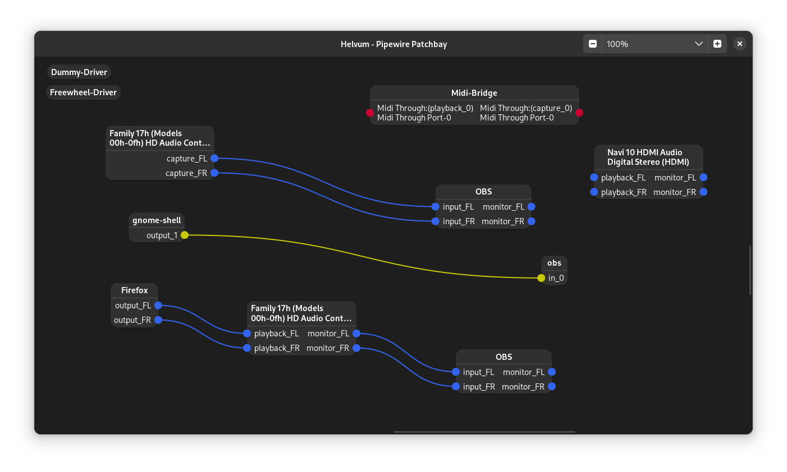

Helvum is a GTK-based patchbay for pipewire, inspired by the JACK tool [catia](https://kx.studio/Applications:Catia).



[](https://repology.org/project/helvum/versions)


# Features planned

- Volume control
- "Debug mode" that lets you view advanced information for nodes and ports

More suggestions are welcome!

# Building

## Via flatpak
If you don't have the flathub repo in your remote-list for flatpak you will need to add that first:
```shell
$ flatpak remote-add --if-not-exists flathub https://flathub.org/repo/flathub.flatpakrepo
```

Then install the required flatpak platform and SDK, if you dont have them already:
```shell
$ flatpak install org.gnome.{Platform,Sdk}//41 org.freedesktop.Sdk.Extension.rust-stable//21.08 org.freedesktop.Sdk.Extension.llvm12//21.08
```

To compile and install as a flatpak, clone the project, change to the project directory, and run:
```shell
$ flatpak-builder --install flatpak-build/ build-aux/org.pipewire.Helvum.json
```

You can then run the app via
```shell
$ flatpak run org.pipewire.Helvum
```

## Manually
For compilation, you will need:

- Meson
- An up-to-date rust toolchain
- `libclang-3.7` or higher
- `gtk-4.0` and `pipewire-0.3` development headers

To compile and install, run

```shell
$ meson setup build && cd build
$ meson compile
$ meson install
```

in the repository root.
This will install the compiled project files into `/usr/local`.

# License
Helvum is distributed under the terms of the GPL3 license.
See LICENSE for more information.
